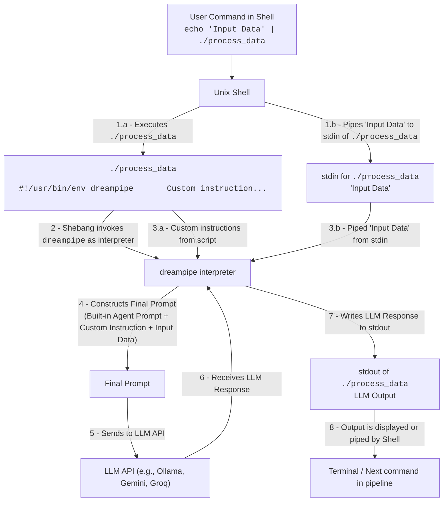

# dreampipe

Adaptive Unix Shell Pipes in Natural Language

## Example

Save the following in a text file named `pirate-speak`

```
#!/usr/bin/env dreampipe

Translate input to pirate speak.
```

Make the `pirate-speak` script executable:

```console
$ chmod +x pirate-speak
```

Try it out:

```console
echo "Hello, World!" | ./pirate-speak
```

## Prompt

Dreampipe builds up the prompt that's sent to the LLM from a built-in agent prompt:

```
You are a Unix command line filter, 
you will follow the instructions below 
to transform, translate, convert, edit or modify 
the input provided below to the desired outcome.
```

Then it appends your prompt from the script, and finally appends the input. Let's look at the whole prompt sent to the LLM for the `pirate-speak` example above:

```
You are a Unix command line filter, 
you will follow the instructions below 
to transform, translate, convert, edit or modify 
the input provided below to the desired outcome.

---

Your task:

Translate input to pirate speak.

---

Input:

Hello, World
```

## Install

Download the latest release for your system from the [Releases](https://github.com/hiway/dreampipe/releases) page.

Extract the binary and move it to one of the following locations:

- `~/bin/dreampipe`: *Recommended*, install only for yourself.
- `/usr/local/bin/dreampipe`: system wide install, requires admin access.

**Example command below, you'll need to use the name of the binary you downloaded:**
```
mv dreampipe-0.0.1-freebsd-arm64 ~/bin/dreampipe
```

## Imagine

### Convert command output to JSON:

Save the following to a new text file `~/bin/anytojson` and make it executable with the command `chmod +x ~/bin/anytojson`.

```
#!/usr/bin/env dreampipe

Convert input to valid JSON. 
If the first line contains column names, prefer them.
Pick appropriate field names if header line is not available.
```

Try it out...

```console
$ echo "Hello, World!" | anytojson 
{"message": "Hello, World!"}
```

Something perhaps more useful?

```console
$ ls -lah /var/log | anytojson
[
    ...
    {
        "permissions": "-rw-r-----",
        "links": 1,
        "user": "root",
        "group": "adm",
        "size": "90K",
        "month": "May",
        "day": 6,
        "time": "14:17",
        "filename": "dmesg"
    },
    ...
]
```

Feeling ambitious?

```console
$ top -bn1 | head | anytojson 
{
  "system_info": {
    "uptime": "5 days, 12:05",
    "users": 2,
    "load_average": [0.51, 0.48, 0.54]
  },
  "tasks": {
    "total": 349,
    "running": 1,
    ...
  },
  "memory": {
    "total": 15887.0,
    "free": 3614.9,
    "used": 6170.7,
    ...
  },
  "processes": [
    {
      "pid": 2636428,
      "user": "user",
      "cpu": 27.3,
      "mem": 0.0,
      "time": "0:00.04",
      "command": "top"
      ...
    },
    ...
  ]
}
```

### Send report for a long running build on exit:

`~/bin/make-report`
```
#!/usr/bin/env dreampipe

Input contains console messages from make command.
Identify whether the command completed successfully or if any errors were encountered resulting in build failure.
Describe the outcome, and if not successful, include primary reason for failure when writing the message next...

Output valid JSON to pipe to notification command with the following fields:

- title: string
- message: string
- success: bool
```

<details>
<summary>View truncated out of make</summary>

```console
make[1]: Nothing to be done for 'all'.
make[1]: Leaving directory '/home/harshad/src/zulefi/gnu-efi/gnuefi'
lld-link /LIBPATH:gnu-efi/x86_64/lib  /SUBSYSTEM:EFI_APPLICATION /ENTRY:EfiMain /NOLOGO /DEBUG:NONE /OPT:REF /OUT:build/BOOTX64.EFI gnu-efi/x86_64/gnuefi/crt0-efi-x86_64.o   build/main.o libgnuefi.a libefi.a
lld-link: error: gnu-efi/x86_64/gnuefi/crt0-efi-x86_64.o: unknown file type
lld-link: error: could not open 'libgnuefi.a': No such file or directory
lld-link: error: unknown file type: data.o
lld-link: error: unknown file type: init.o
lld-link: error: unknown file type: print.o
make: *** [Makefile:76: build/BOOTX64.EFI] Error 1
```

</details>

```console
$ make | tail -n 10 | make-report
{
  "title": "Make Build Failed",
  "message": "The make command failed. Primary reason for failure: lld-link encountered errors, including an unknown file type for 'gnu-efi/x86_64/gnuefi/crt0-efi-x86_64.o' and inability to open 'libgnuefi.a' (No such file or directory).",
  "success": false
}
```

Not bad, now pipe that to a command to notify a phone:

```console
$ make | tail -n 10 | make-report | pushover
```

> Here, `pushover` is only an example. Use any notification system you prefer and tweak the output as you need in your `make-report` script.

### Ad-hoc Pipes

```console
$ df -h | dreampipe "Write a haiku about the storage situation"
Disk space is filling,
Over half of home is used,
Time to clean things up.
```

## Data Flow Diagram

This diagram illustrates the flow of data when `dreampipe` is used in a Unix pipeline.


