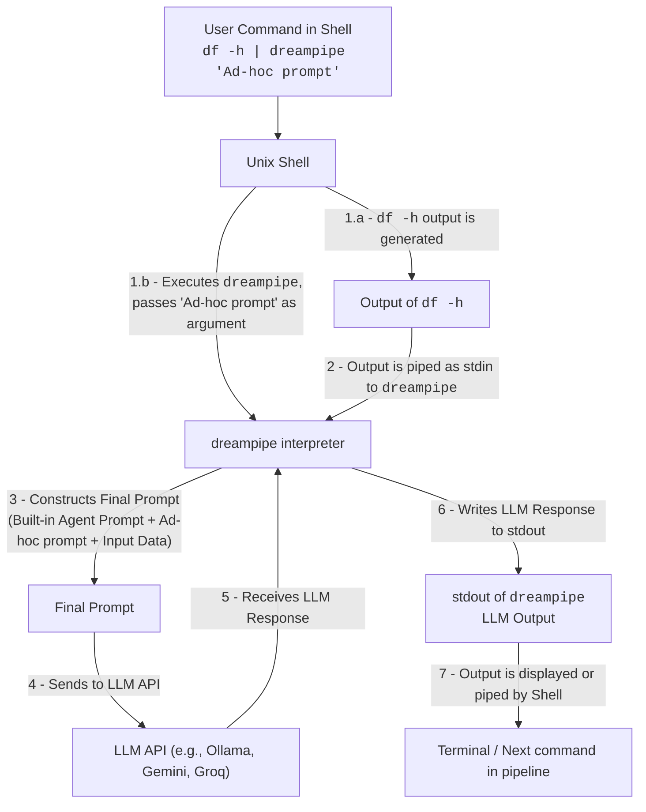
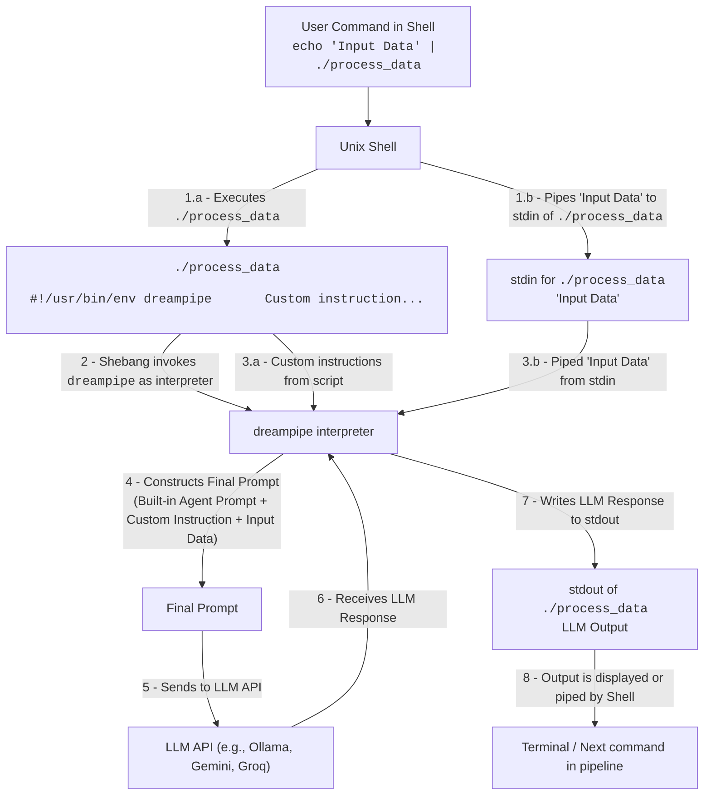
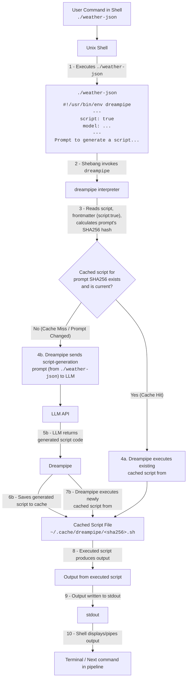

# dreampipe

Adaptive Unix Shell Pipes and Scripts in Natural Language

## Quick Start

Transform shell command output into creative or structured responses using natural language:

```console
$ df -h | dreampipe "Write a haiku about the storage situation"
Disk space is filling,
Over half of home is used,
Time to clean things up.
```

## Installation

Download the latest release for your system from the [Releases](https://github.com/hiway/dreampipe/releases) page.

Extract the binary and move it to one of the following locations:

- `~/bin/dreampipe`: *Recommended*, install for yourself.
- `/usr/local/bin/dreampipe`: system-wide install, requires admin access.

**Example command below, you'll need to use the name of the binary you downloaded:**
```console
mv dreampipe-0.0.1-freebsd-arm64 ~/bin/dreampipe
```

## Usage Examples

### Example 1: Ad-hoc Pipes

Use `dreampipe` directly in a Unix pipeline to process command output with natural language prompts:

```console
$ df -h | dreampipe "Write a haiku about the storage situation"
Disk space is filling,
Over half of home is used,
Time to clean things up.
```

Here's how the data flows in an ad-hoc pipe:




### Example 2: Prompts as Saved Commands

Save a prompt as a script for reuse. For example, create a script to translate text to pirate speak:

1. Save the following in a file named `pirate-speak`:

    ```bash
    #!/usr/bin/env dreampipe

    Translate input to pirate speak.
    ```

2. Make the script executable:

    ```console
    $ chmod +x pirate-speak
    ```

3. Try it out:

    ```console
    $ echo "Hello, World!" | ./pirate-speak
    Ahoy, World!
    ```

Dreampipe appends the prompt from your script to a built-in agent prompt, and finally appends the piped-in input. Let's look at the whole prompt sent to the LLM for the `pirate-speak` example above:

```
You are a Unix command line filter, 
you will follow the instructions below 
to transform, translate, convert, edit or modify 
the input provided below to the desired outcome.

---

Your task:

Translate input to pirate speak.

---

Input:

Hello, World
```

And here's a visual explanation of the data flow when used in a Unix pipeline:




### Example 3: Auto-updating Shell Scripts

Create scripts that auto-update based on natural language prompts. For example, generate a weather report script:

1. Save the following in a file named `weather-json`:

    ```bash
    #!/usr/bin/env dreampipe
    ---
    script: true
    model: gemini-2.0-flash
    ---

    Shell script to use the following API to fetch 
    and output the weather overview as JSON.
    Use the configuration below to populate the API fields.
    Read the appid from a toml file "~/.secrets/openweathermap.conf" 
    which contains `appid = "..."`

    Config:
      - units: metric
      - lat: 0
      - lon: 0

    ---

    OpenWeatherMap One Call API 3.0 

    Weather overview

    This section describes how to get weather overview with a human-readable weather summary for today and tomorrow's forecast, utilizing OpenWeather AI technologies.

    https://api.openweathermap.org/data/3.0/onecall/overview?lat={lat}&lon={lon}&appid={API key}

    Parameters
    lat 	required 	Latitude, decimal (-90; 90)
    lon 	required 	Longitude, decimal (-180; 180)
    appid 	required 	Your unique API key (you can always find it on your account page under the "API key" tab)
    date 	optional 	The date the user wants to get a weather summary in the YYYY-MM-DD format. 
    units 	optional 	Units of measurement. 

    Data is available for today and tomorrow. If not specified, the current date will be used by default. Please note that the date is determined by the timezone relevant to the coordinates specified in the API request.

    Standard, metric, and imperial units are available. If you do not use the units parameter, standard units will be applied by default.
    ```

2. Make the script executable:

    ```console
    $ chmod +x weather-json
    ```

3. Run the script:

    ```console
    $ weather-json
    {
        ...
    }
    ```

Dreampipe processes scripts as Markdown files with YAML frontmatter, where you can configure behavior using `key: value` pairs. When you set `script: true` in the frontmatter, dreampipe implements an intelligent caching mechanism:

1. It calculates a SHA256 hash of your script content to track changes
2. The first time it runs (or after you modify the prompt), it sends the prompt to an LLM
3. The LLM generates executable code (shell script, Python program, etc.)
4. This generated code is cached in a file named with the content's SHA256 hash and an appropriate extension
5. On subsequent runs, dreampipe executes the cached script directly, bypassing the LLM

This approach is both efficient and environmentally responsible when:
- Input/output structures are well-defined and can be programmatically transformed
- You need a specific shell script or program to accomplish a task

Simply express your requirements in natural language, and dreampipe handles the rest — automatically regenerating the script only when you modify your prompt.

Here's a visual explanation of this auto-updating script flow:



### Example 4: Send Report for Long-Running Build

Create a script to summarize the output of a long-running command, like a build process, and send a notification.

1.  Save the following as `~/bin/make-report` (and make it executable with `chmod +x ~/bin/make-report`):

    ```bash
    #!/usr/bin/env dreampipe

    Input contains console messages from a make command.
    Identify whether the command completed successfully,
    or if errors were encountered resulting in build failure.
    Describe the outcome, and if not successful,
    include the primary reason for failure when writing the message next...

    Output valid JSON to pipe to a notification command with the following fields:

    - title: string
    - message: string
    - success: bool
    ```

2.  Example of a failed build output (truncated for brevity):

    <details>
    <summary>View truncated output of make</summary>

    ```console
    make[1]: Nothing to be done for 'all'.
    make[1]: Leaving directory '/home/user/src/project/module'
    lld-link /LIBPATH:module/x86_64/lib  /SUBSYSTEM:EFI_APPLICATION /ENTRY:EfiMain /NOLOGO /DEBUG:NONE /OPT:REF /OUT:build/BOOTX64.EFI module/x86_64/module/crt0-efi-x86_64.o build/main.o libmodule.a libefi.a
    lld-link: error: module/x86_64/module/crt0-efi-x86_64.o: unknown file type
    lld-link: error: could not open 'libmodule.a': No such file or directory
    make: *** [Makefile:101: build/BOOTX64.EFI] Error 1
    ```
    </details>

3.  Pipe the build output to your `make-report` script:

    ```console
    $ make 2>&1 | tail -n 10 | make-report
    {
      "title": "Make Build Failed",
      "message": "The make command failed. Primary reason for failure: lld-link encountered errors, including an unknown file type for 'module/x86_64/module/crt0-efi-x86_64.o' and inability to open 'libmodule.a' (No such file or directory).",
      "success": false
    }
    ```

4.  You can then pipe this JSON to a notification service (e.g., `pushover`):

    ```console
    $ make 2>&1 | tail -n 10 | make-report | pushover
    ```
    > Note: `pushover` is just an example. Adapt the `make-report` script and the notification command to your preferred tools.

## Advanced Features

### Handling Standard Error (stderr)

Process `stderr` by redirecting it to `stdout`:

```console
$ some_command_that_fails 2>&1 | dreampipe "Summarize any errors in this output"
```

### Named Pipes (FIFOs)

Use named pipes to process data streams:

```console
$ mkfifo mydata
$ long_running_process > mydata &
$ dreampipe "Analyze the data as it comes from mydata" < mydata
```

**Important Note on Streaming:** Currently, `dreampipe` does not support true streaming of data. It reads the entire input from the pipe (or stdin) into memory before processing it. This has several implications when using FIFOs:

*   **Blocking Behavior:** `dreampipe` will wait until the process writing to the FIFO closes its end of the pipe before it begins processing. If the writing process keeps the FIFO open indefinitely (e.g., a continuous log), `dreampipe` may appear to hang.
*   **Memory Consumption:** For very large data streams, reading the entire content into memory can lead to high memory usage.
*   **Latency:** No output will be generated by `dreampipe` until the entire input stream has been received and processed. This is not suitable for scenarios requiring real-time or low-latency responses to partial data.

While FIFOs can still be used, be mindful of these limitations, especially with long-running processes or large datasets.

### Using `tee` for Splitting Output

The `tee` command reads from standard input and writes to standard output while simultaneously copying the input to one or more files. `dreampipe`'s input or output can be split using `tee`.

*   Log the raw input *before* `dreampipe` processes it:
    ```console
    $ df -h | tee raw_df_output.txt | dreampipe "Write a haiku"
    ```
*   Log the output *from* `dreampipe` while also passing it to another command or displaying it:
    ```console
    $ df -h | dreampipe "Summarize storage" | tee summary.txt | less
    ```
This is an existing capability through combining `dreampipe` with `tee`.

### Process Substitution (`<()` and `>()`)

Process substitution is a shell feature (common in `bash`, `zsh`) that allows the output of a process to be treated as if it were a file. This can be useful for providing `dreampipe`'s output to commands that expect filenames.

*   Use `dreampipe`'s output where a file is expected:
    ```console
    $ diff -u original_text.txt <(cat original_text.txt | dreampipe "Translate this to pirate speak")
    ```
    If `dreampipe` were to accept file arguments for prompts or context (it currently uses stdin for data and command-line args for ad-hoc prompts), process substitution could also be used to provide these dynamically:
    ```console
    # Hypothetical: dreampipe takes a context file and data on stdin
    $ some_command | dreampipe --context <(generate_context_dynamically) "Analyze based on context"
    ```
This functionality is provided by the shell and can be used with `dreampipe` as with any other command.

### Structured Data Awareness

Instruct `dreampipe` to produce structured outputs like JSON.
You can create a script, for example, `~/bin/anytojson` (don't forget to make it executable with `chmod +x ~/bin/anytojson`):

```bash
#!/usr/bin/env dreampipe

Convert input to valid JSON.
If the first line contains column names, prefer them.
Pick appropriate field names if header line is not available.
```

Try it out:

```console
$ echo "Hello, World!" | anytojson
{"message": "Hello, World!"}
```

Something perhaps more useful?

```console
$ ls -lah /var/log | anytojson
[
    {
        "permissions": "-rw-r-----",
        "links": 1,
        "user": "root",
        "group": "adm",
        "size": "90K",
        "month": "May",
        "day": 12,
        "time": "10:00",
        "filename": "dmesg"
    }
    // ... (other files)
]
```

Feeling ambitious?

```console
$ top -bn1 | head -n 20 | anytojson
{
  "system_info": {
    "uptime": "5 days, 12:05",
    "users": 2,
    "load_average": [0.51, 0.48, 0.54]
  },
  "tasks": {
    "total": 349,
    "running": 1,
    "sleeping": 348,
    "stopped": 0,
    "zombie": 0
  },
  "cpu_usage": {
    // ... cpu usage details ...
  },
  "memory": {
    "total": 15887.0,
    "free": 3614.9,
    "used": 6170.7,
    "buff_cache": 6101.4
  },
  "swap": {
    // ... swap details ...
  },
  "processes": [
    {
      "pid": 2636428,
      "user": "user",
      "pr": "20",
      "ni": "0",
      "virt": "100m",
      "res": "50m",
      "shr": "30m",
      "s": "R",
      "cpu_percent": 27.3,
      "mem_percent": 0.3,
      "time_plus": "0:00.04",
      "command": "top"
    }
    // ... (other processes)
  ]
}
```
