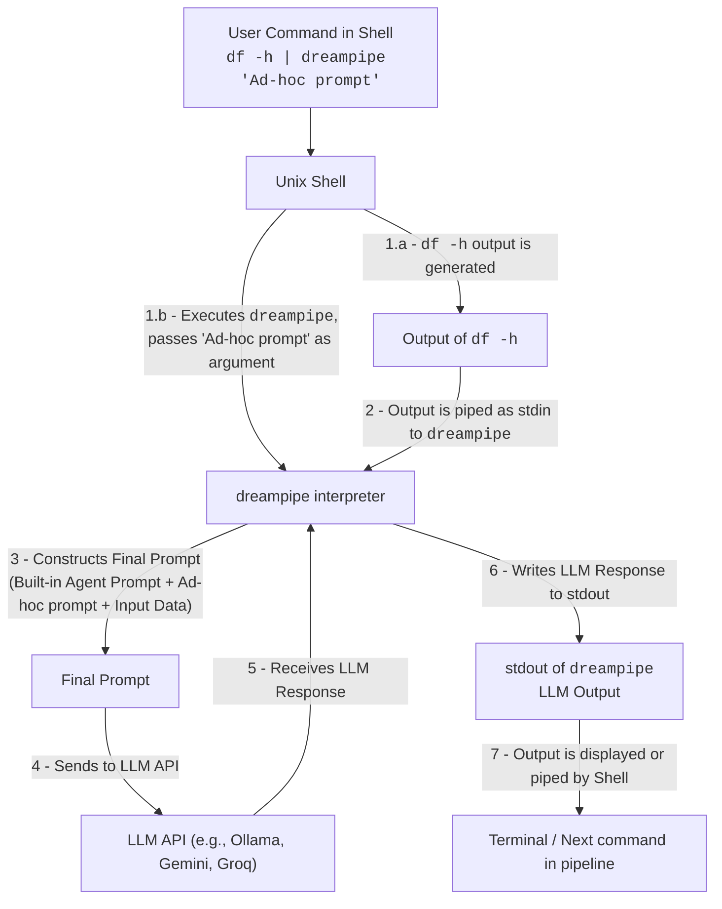
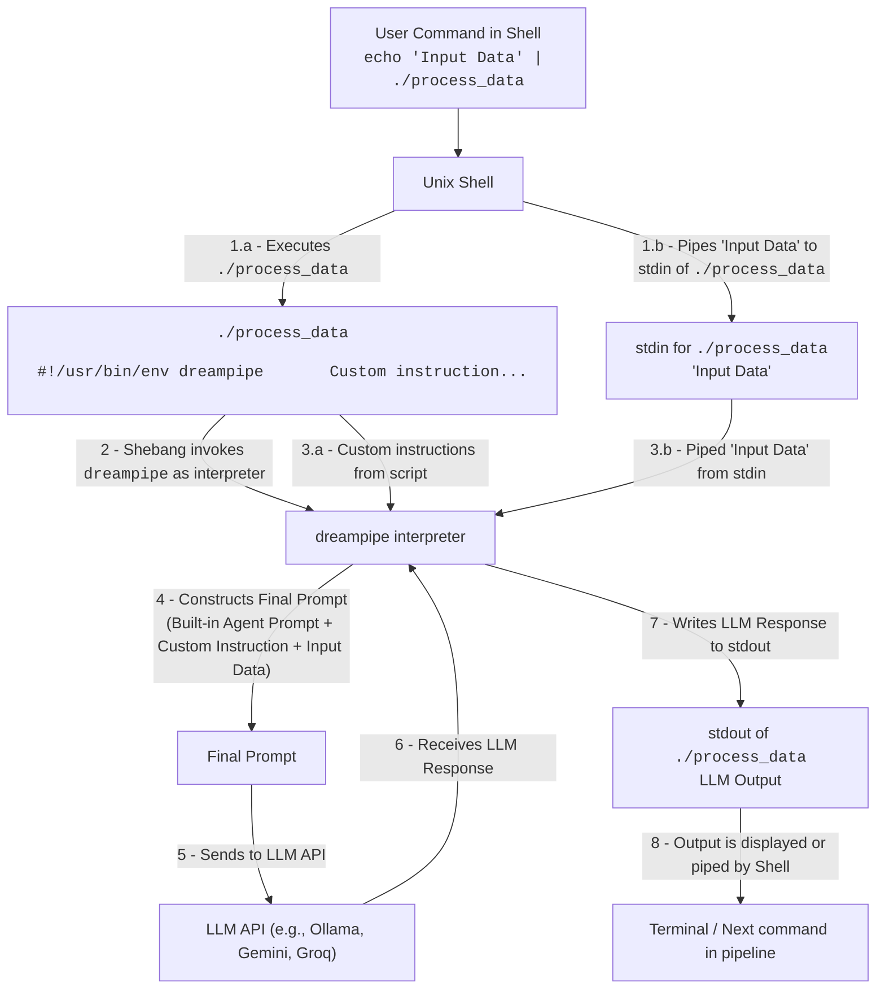

# dreampipe

Adaptive Unix Shell Pipes and Scripts in Natural Language

## Quick Start

**First, you need to configure at least one LLM provider:**

```console
$ dreampipe config
```

**Then transform shell command output into creative or structured responses:**

```console
$ df -h | dreampipe "Write a haiku about the storage situation"
Disk space is filling,
Over half of home is used,
Time to clean things up.
```

## Installation

Download the latest release for your system from the [Releases](https://github.com/hiway/dreampipe/releases) page.

### Download and Extract

1. **Download the appropriate archive** for your system:
   - Linux: `dreampipe-{version}-linux-amd64.tar.gz` or `dreampipe-{version}-linux-arm64.tar.gz`
   - macOS: `dreampipe-{version}-darwin-amd64.tar.gz` or `dreampipe-{version}-darwin-arm64.tar.gz`
   - FreeBSD: `dreampipe-{version}-freebsd-amd64.tar.gz` or `dreampipe-{version}-freebsd-arm64.tar.gz`

   **Optional but recommended:** Also download `checksums.txt` to verify the integrity of your download:
   ```console
   # Verify checksum (Linux/macOS/FreeBSD)
   sha256sum -c --ignore-missing checksums.txt
   # Or on macOS:
   shasum -a 256 -c --ignore-missing checksums.txt
   ```

2. **Extract the archive** into a subdirectory:
   ```console
   # Replace with your downloaded filename
   mkdir dreampipe-v0.1.0
   tar -xzf dreampipe-v0.1.0-linux-amd64.tar.gz -C dreampipe-v0.1.0
   cd dreampipe-v0.1.0
   ```

3. **Install the binary** to one of the following locations:
   - `~/bin/dreampipe`: *Recommended*, install for yourself
   - `/usr/local/bin/dreampipe`: system-wide install, requires admin access

   **For user installation** (recommended):
   ```console
   # Create ~/bin directory if it doesn't exist
   mkdir -p ~/bin
   
   # Move the binary
   cp dreampipe ~/bin/dreampipe
   
   # Make sure ~/bin is in your PATH (choose one based on your shell)
   # For bash/zsh:
   echo 'export PATH="$HOME/bin:$PATH"' >> ~/.bashrc
   source ~/.bashrc
   
   # For zsh (if using zsh):
   echo 'export PATH="$HOME/bin:$PATH"' >> ~/.zshrc
   source ~/.zshrc
   ```

   **For system-wide installation:**
   ```console
   # Requires admin privileges
   sudo cp dreampipe /usr/local/bin/dreampipe
   ```

4. **Optionally install example scripts** to `~/bin/`:
   ```console
   # Create ~/bin directory if it doesn't exist
   mkdir -p ~/bin
   
   # Copy example scripts (removes .md extension) and make them executable
   for script in examples/*.md; do
       basename=$(basename "$script" .md)
       cp "$script" ~/bin/"$basename"
       chmod +x ~/bin/"$basename"
   done
   ```
   
   This will install scripts like `examples/eli5.md` as `~/bin/eli5`, making them available as commands.

5. **Verify installation:**
   ```console
   dreampipe --version
   ```

6. **Configure dreampipe:**
   On first run, `dreampipe` will prompt you to create a configuration file. You'll need to provide API keys for at least one LLM provider:
   
   ```console
   # This will guide you through initial configuration
   dreampipe config
   ```
   
   **LLM Provider Options:**
   - **Ollama** (local): Install and run [Ollama](https://ollama.ai/) locally, then use default settings
   - **Gemini** (cloud): Get an API key from [Google AI Studio](https://makersuite.google.com/app/apikey)
   - **Groq** (cloud): Get an API key from [Groq Console](https://console.groq.com/keys)

7. **Test your installation:**
   ```console
   echo "Hello, World!" | dreampipe "translate to pirate speak"
   ```

### Or, Build from Source

Alternatively, you can clone the repository and build `dreampipe` from source using Make. This method is suitable if you want the latest development version or want to contribute to the project.

1.  **Clone the repository:**
    ```console
    git clone https://github.com/hiway/dreampipe.git
    cd dreampipe
    ```

2.  **Build and install:**
    ```console
    make installuser
    ```
    This command will:
    *   Build the `dreampipe` binary from the source code.
    *   Install the binary to `~/bin/dreampipe`. Ensure `~/bin` is in your `PATH`.
    
    Alternatively, you can install system-wide (requires admin access):
    ```console
    make install
    ```
    This will install the binary to `/usr/local/bin/dreampipe`.

### Installing Example Scripts

The project includes a variety of example scripts in the `examples/` directory. These scripts demonstrate different use cases for `dreampipe` and can be installed into your `~/bin` directory to be used as commands.

To install these example scripts, you can use the `install-examples` target in the Makefile:

```console
make install-examples
```

This command will:
1. Create the `~/bin` directory if it doesn't already exist.
2. Copy each example script (e.g., `examples/eli5.md`) to `~/bin/eli5`.
3. Make each installed script executable (e.g., `chmod +x ~/bin/eli5`).

After running this, you can use the example scripts directly:

```console
$ echo "Large language models are very powerful." | eli5
Large language models are like super smart talking parrots. You can tell them something, and they can say it back to you in a really simple way, like you're a little kid! They know lots and lots of words and can understand what you mean, even if you say it in a tricky way. So, if you have something big and complicated, they can help make it easy-peasy to understand!
```

## Configuration

`dreampipe` uses a configuration file located at `$XDG_CONFIG_HOME/dreampipe/config.toml` (typically `~/.config/dreampipe/config.toml`).

### First-Time Setup

On your first run, `dreampipe` will automatically prompt you to create a configuration file:

```console
$ dreampipe config
```

This command will:
1. Create the configuration file if it doesn't exist
2. Guide you through setting up at least one LLM provider
3. Open the configuration file in your preferred editor

### LLM Provider Setup

You need to configure at least one LLM provider:

#### Ollama (Local, Free)
1. Install [Ollama](https://ollama.ai/) on your system
2. Run `ollama serve` to start the server
3. Pull a model: `ollama pull llama3`
4. Use default settings in dreampipe config (http://localhost:11434)

#### Gemini (Cloud, API Key Required)
1. Get an API key from [Google AI Studio](https://makersuite.google.com/app/apikey)
2. Enter the API key when prompted during configuration

#### Groq (Cloud, API Key Required)
1. Get an API key from [Groq Console](https://console.groq.com/keys)
2. Enter the API key when prompted during configuration

### Manual Configuration

You can also manually edit the configuration file. See `config.toml.sample` for all available options.

### Troubleshooting

**"configuration file creation declined by user"**
- Run `dreampipe config` to create the configuration file
- You need at least one LLM provider configured

**"Missing instruction" error**
- Always provide an instruction: `dreampipe "your instruction"`
- Or create a script with shebang: `#!/usr/bin/env dreampipe`

**Connection issues with Ollama**
- Make sure Ollama is running: `ollama serve`
- Check if a model is available: `ollama list`
- Pull a model if needed: `ollama pull llama3`

**API key issues**
- Make sure your API keys are valid and have proper permissions
- Check your API usage limits/quotas

## Usage Examples

### Example 1: Ad-hoc Pipes

Use `dreampipe` directly in a Unix pipeline to process command output with natural language prompts:

```console
$ df -h | dreampipe "Write a haiku about the storage situation"
Disk space is filling,
Over half of home is used,
Time to clean things up.
```

When you run this command, dreampipe reads the instruction "Write a haiku about the storage situation." It then combines this with a built-in agent prompt and the piped-in data (output from `df -h`) to form a complete request for the LLM. The LLM's response is then outputted.

Let's look at the whole prompt sent to the LLM for the example above:

```
You are a Unix command line filter, 
you will follow the instructions below 
to transform, translate, convert, edit or modify 
the input provided below to the desired outcome.

---

Your task:

Write a haiku about the storage situation

---

Input:

Filesystem      Size  Used Avail Use% Mounted on
/dev/sda1        50G   28G   20G  59% /
tmpfs           3.0G     0  3.0G   0% /dev/shm
/dev/sda2       450G  228G  200G  54% /home
```

Here's how the data flows in an ad-hoc pipe:



### Example 2: Prompts as Saved Commands (Natural Language Scripts)

Save a prompt as a reusable "natural language script." `dreampipe` interprets these scripts to transform input data. For example, create a script to translate text to pirate speak:

1.  Save the following in a file named `pirate-speak`:

    ```bash
    #!/usr/bin/env dreampipe

    Translate input to pirate speak.
    ```

2.  Make the script executable:

    ```console
    $ chmod +x pirate-speak
    ```

3.  Try it out:

    ```console
    $ echo "Hello, World!" | ./pirate-speak
    Ahoy, World!
    ```

When you execute `pirate-speak`, the `dreampipe` interpreter (invoked by the shebang `#!/usr/bin/env dreampipe`) reads the instruction "Translate input to pirate speak." It then combines this with a built-in agent prompt and the piped-in data ("Hello, World!") to form a complete request for the LLM. The LLM's response is then outputted.

Let's look at the whole prompt sent to the LLM for the `pirate-speak` example above:

```
You are a Unix command line filter, 
you will follow the instructions below 
to transform, translate, convert, edit or modify 
the input provided below to the desired outcome.

---

Your task:

Translate input to pirate speak.

---

Input:

Hello, World
```

And here's a visual explanation of the data flow when used in a Unix pipeline:



### Example 3: Send Report for Long-Running Build

Create a script to summarize the output of a long-running command, like a build process, and send a notification.

1.  Save the following as `~/bin/make-report` (and make it executable with `chmod +x ~/bin/make-report`):

    ```bash
    #!/usr/bin/env dreampipe

    Input contains console messages from a make command.
    Identify whether the command completed successfully,
    or if errors were encountered resulting in build failure.
    Describe the outcome, and if not successful,
    include the primary reason for failure when writing the message next...

    Output valid JSON to pipe to a notification command with the following fields:

    - title: string
    - message: string
    - success: bool
    ```

2.  Example of a failed build output (truncated for brevity):

    <details>
    <summary>View truncated output of make</summary>

    ```console
    make[1]: Nothing to be done for 'all'.
    make[1]: Leaving directory '/home/user/src/project/module'
    lld-link /LIBPATH:module/x86_64/lib  /SUBSYSTEM:EFI_APPLICATION /ENTRY:EfiMain /NOLOGO /DEBUG:NONE /OPT:REF /OUT:build/BOOTX64.EFI module/x86_64/module/crt0-efi-x86_64.o build/main.o libmodule.a libefi.a
    lld-link: error: module/x86_64/module/crt0-efi-x86_64.o: unknown file type
    lld-link: error: could not open 'libmodule.a': No such file or directory
    make: *** [Makefile:101: build/BOOTX64.EFI] Error 1
    ```
    </details>

3.  Pipe the build output to your `make-report` script:

    ```console
    $ make 2>&1 | tail -n 10 | make-report
    {
      "title": "Make Build Failed",
      "message": "The make command failed. Primary reason for failure: lld-link encountered errors, including an unknown file type for 'module/x86_64/module/crt0-efi-x86_64.o' and inability to open 'libmodule.a' (No such file or directory).",
      "success": false
    }
    ```

4.  You can then pipe this JSON to a notification service (e.g., `pushover`):

    ```console
    $ make 2>&1 | tail -n 10 | make-report | pushover
    ```
    > Note: `pushover` is just an example. Adapt the `make-report` script and the notification command to your preferred tools.

## Advanced Features

### Handling Standard Error (stderr)

Process `stderr` by redirecting it to `stdout`:

```console
$ some_command_that_fails 2>&1 | dreampipe "Summarize any errors in this output"
```

### Named Pipes (FIFOs)

Use named pipes to process data streams:

```console
$ mkfifo mydata
$ long_running_process > mydata &
$ dreampipe "Analyze the data as it comes from mydata" < mydata
```

**Important Note on Streaming:** Currently, `dreampipe` does not support true streaming of data. It reads the entire input from the pipe (or stdin) into memory before processing it. This has several implications when using FIFOs:

*   **Blocking Behavior:** `dreampipe` will wait until the process writing to the FIFO closes its end of the pipe before it begins processing. If the writing process keeps the FIFO open indefinitely (e.g., a continuous log), `dreampipe` may appear to hang.
*   **Memory Consumption:** For very large data streams, reading the entire content into memory can lead to high memory usage.
*   **Latency:** No output will be generated by `dreampipe` until the entire input stream has been received and processed. This is not suitable for scenarios requiring real-time or low-latency responses to partial data.

While FIFOs can still be used, be mindful of these limitations, especially with long-running processes or large datasets.

### Using `tee` for Splitting Output

The `tee` command reads from standard input and writes to standard output while simultaneously copying the input to one or more files. `dreampipe`'s input or output can be split using `tee`.

*   Log the raw input *before* `dreampipe` processes it:
    ```console
    $ df -h | tee raw_df_output.txt | dreampipe "Write a haiku"
    ```
*   Log the output *from* `dreampipe` while also passing it to another command or displaying it:
    ```console
    $ df -h | dreampipe "Summarize storage" | tee summary.txt | less
    ```

### Process Substitution (`<()` and `>()`)

Process substitution is a shell feature (common in `bash`, `zsh`) that allows the output of a process to be treated as if it were a file. This can be useful for providing `dreampipe`'s output to commands that expect filenames.

*   Use `dreampipe`'s output where a file is expected:
    ```console
    $ diff -u original_text.txt <(cat original_text.txt | dreampipe "Translate this to pirate speak")
    ```
    If `dreampipe` were to accept file arguments for prompts or context (it currently uses stdin for data and command-line args for ad-hoc prompts), process substitution could also be used to provide these dynamically:
    ```console
    # Hypothetical: dreampipe takes a context file and data on stdin
    $ some_command | dreampipe --context <(generate_context_dynamically) "Analyze based on context"
    ```

### Structured Data Awareness

Instruct `dreampipe` to produce structured outputs like JSON.
You can create a script, for example, `~/bin/anytojson` (don't forget to make it executable with `chmod +x ~/bin/anytojson`):

```bash
#!/usr/bin/env dreampipe

Convert input to valid JSON.
If the first line contains column names, prefer them.
Pick appropriate field names if header line is not available.
```

Try it out:

```console
$ echo "Hello, World!" | anytojson
{"message": "Hello, World!"}
```

Something perhaps more useful?

```console
$ ls -lah /var/log | anytojson
[
    {
        "permissions": "-rw-r-----",
        "links": 1,
        "user": "root",
        "group": "adm",
        "size": "90K",
        "month": "May",
        "day": 12,
        "time": "10:00",
        "filename": "dmesg"
    }
    // ... (other files)
]
```

Feeling ambitious?

```console
$ top -bn1 | head -n 20 | anytojson
{
  "system_info": {
    "uptime": "5 days, 12:05",
    "users": 2,
    "load_average": [0.51, 0.48, 0.54]
  },
  "tasks": {
    "total": 349,
    "running": 1,
    "sleeping": 348,
    "stopped": 0,
    "zombie": 0
  },
  "cpu_usage": {
    // ... cpu usage details ...
  },
  "memory": {
    "total": 15887.0,
    "free": 3614.9,
    "used": 6170.7,
    "buff_cache": 6101.4
  },
  "swap": {
    // ... swap details ...
  },
  "processes": [
    {
      "pid": 2636428,
      "user": "user",
      "pr": "20",
      "ni": "0",
      "virt": "100m",
      "res": "50m",
      "shr": "30m",
      "s": "R",
      "cpu_percent": 27.3,
      "mem_percent": 0.3,
      "time_plus": "0:00.04",
      "command": "top"
    }
    // ... (other processes)
  ]
}
```
